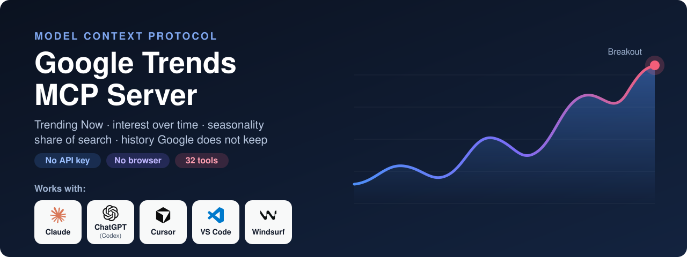

<p align="center"></p>

# Google Trends MCP Server — gtrends-mcp-full

**The complete MCP server for Google Trends.** Ask Claude, Cursor, Windsurf, VS Code, Codex or any other MCP client what people are searching, where, when, and what is taking off right now — and get analysis back, not a chart to squint at.

32 tools · Trending Now with real search volumes · interest over time, by region and related searches · seasonality, momentum and share of search · no API key, no browser, no sign-in.

[](https://pypi.org/project/gtrends-mcp-full/)
[](https://github.com/mamrrez/gtrends-mcp-full/actions/workflows/ci.yml)
[](https://www.python.org/)
[](https://github.com/modelcontextprotocol/python-sdk)
[](https://github.com/mamrrez/gtrends-mcp-full/blob/main/LICENSE)

**[Project page](https://hasanpour.com/tools/google-trends-mcp/)** · **[Quick start](#quick-start)** · **[Tools](#tools)** · **[Prompts](#prompts)** · **[Configuration](#configuration)** · **[How it stays unblocked](#how-it-stays-unblocked)** · **[FAQ](#faq)** · **[Docs](https://mamrrez.github.io/gtrends-mcp-full/)**

---

## What you get

| | |
|---|---|
| ✅ **Complete** | Everything the Google Trends website shows: the full Trending Now list (hundreds of trends per country, with search volume, growth, start time, category and the queries inside each one), the news behind a trend, interest over time down to the minute, interest by country, region, city and metro area, related queries and topics, every category and location, Web, YouTube, News, Images and Shopping search. |
| 🔑 **Nothing to set up** | No API key, no Google Cloud project, no sign-in, no headless browser. Install it and ask. |
| 🧠 **Answers, not charts** | Is it growing or fading? When does it peak, and when must the content be live? Who is winning share of search? What suddenly jumped, and when? Worked out for you and returned as short tables your AI can reason about. |
| 📈 **Past the limits of the website** | Compare 25 terms on one scale instead of five. Daily data over years instead of nine months. Trending Now history kept for as long as you like instead of one week. |
| 🛡️ **Built to keep working** | Paced requests, a persistent session, back-off instead of hammering, and a cache that still answers — and says so — when Google will not. Related-searches and chart requests are budgeted separately, so a limit on one never takes down the rest. |
| 🎯 **Honest numbers** | Every value is labelled for what it is: Google's 0–100 index, never a search count. Partial periods are marked. A failure is an error with its reason and what to do next, never an empty result. |
| 💸 **Free and light** | MIT licensed. Two dependencies. Runs on your machine; nothing is sent anywhere but Google. Tested on Linux, macOS and Windows with Python 3.10–3.13. |

**Works with:** Claude Desktop · Claude Code · Cursor · Windsurf · VS Code (Copilot agent mode) · OpenAI Codex CLI · any MCP client over stdio or HTTP.

## Tools

32 tools in 5 groups. You don't call them yourself — ask in plain language and your AI picks the right one.

🗄️ works on the local data file, no request to Google

### 🔥 Trending now

| Tool | What it gives you | Ask it like this |
|---|---|---|
| `trending_now` | The full Trending Now list for a country or region: search volume, growth, start time, still active or over, category, and the other queries people type for the same story. Filter by category, status, volume or text | *"What's trending in Germany in the last 4 hours?"* · *"Active sports trends in the US above 100K searches"* |
| `trend_details` | One trend in full: every query inside it, the news articles behind it, and its hour-by-hour curve for the past week | *"Why is 'pentobarbital' trending?"* |
| `trending_feed` | The top daily trends with headlines and links — the fastest answer to "what's in the news there today" | *"Give me today's top searches in Iran with the headlines"* |
| `trending_across_countries` | Trends that are live in several countries at once, grouped even when titles differ | *"What is trending in both the US and the UK right now?"* |
| `match_trends` | Which current trends touch your subjects, brands or products — for newsjacking | *"Is anything about electric cars, Tesla or charging trending today?"* |

### 🔎 Explore a keyword

| Tool | What it gives you | Ask it like this |
|---|---|---|
| `keyword_overview` | The whole Trends page in one call: curve, direction, top places, rising and top related queries | *"Give me the Google Trends picture for 'heat pump' in the UK"* |
| `interest_over_time` | The main chart for up to 5 terms on one scale — any range from one hour to 2004-today, any location, category and search type, with operators (`a + b`, `a -b`, `"a b"`) | *"Compare tesla and byd over 5 years in Germany"* · *"YouTube interest in 'lofi' this week"* |
| `interest_by_region` | Where a term matters most: countries, regions, cities or metro areas. With several terms: who leads where | *"Which US states search 'tesla' the most?"* · *"Where does byd beat tesla?"* |
| `related_queries` | What else people search around a term — the top queries and the rising ones, with breakouts flagged | *"What are the rising searches around 'solar panels'?"* |
| `related_topics` | The people, brands and things searched alongside a term, with topic ids | *"Which topics are related to 'tesla'?"* |
| `compare_periods` | One term in two time ranges on one scale: this year against last, this quarter against the one before | *"Is 'sunscreen' ahead of last summer?"* |
| `compare_locations` | One term in up to 5 countries or regions side by side | *"Compare interest in cricket in India, the UK and Australia"* |

### 🧠 Analysis

| Tool | What it gives you | Ask it like this |
|---|---|---|
| `trend_momentum` | A verdict per term — breakout, rising, stable, declining or new — with year-over-year change, last quarter vs the one before, long-run slope and distance from its peak | *"Which of these eight product ideas is actually growing?"* |
| `seasonality` | The yearly rhythm: a month-by-month index, peak and low months, how reliably it repeats, year-by-year growth, the next six months, and the date content should be live | *"When do people search for air conditioners, and when should I publish?"* |
| `content_calendar` | A publishing calendar for up to 8 topics, sorted by what is due first; evergreen topics listed separately | *"Build me a content calendar for these topics"* |
| `share_of_search` | Your brand's share of searches against up to 4 competitors — overall, at the start, at the end, and the change in points | *"What's Toyota's share of search against Honda, Ford and Tesla?"* |
| `compare_many` | 6 to 25 terms ranked on a single scale, past the five-term limit of the website | *"Rank these 20 car brands by search interest in the US"* |
| `find_spikes` | The moments a term jumped: when each spike began, peaked and ended, and how many times the usual level it reached | *"When did searches for 'earthquake' spike in the last five years?"* |
| `daily_history` | Day-by-day interest over years (the website stops at about nine months), plus the weekday pattern | *"Daily interest in 'pizza delivery' for 2024 and 2025 — which weekday is biggest?"* |
| `keyword_ideas` | Rising and top related queries for up to 5 seeds, merged and de-duplicated, breakouts first | *"Give me keyword ideas around 'electric bike' and 'e-scooter'"* |

### 🗄️ History that Google does not keep

| Tool | What it gives you | Ask it like this |
|---|---|---|
| `snapshot_trending` | Saves the current Trending Now list to a local file. Google drops a trend after about a week; this keeps it | *"Save today's trends for the US, UK and Germany"* |
| `trending_history` 🗄️ | Searches everything saved: when something trended, how big it got, how long it lasted | *"Did anything about 'iphone' trend in the US last month?"* |
| `watchlist_add` 🗄️ | Puts terms on a watchlist, per location, with a note | *"Watch 'heat pump' and 'solar panels' in the UK"* |
| `watchlist_report` | The watchlist measured now: direction, what changed since the last report, and whether a term is trending today | *"How is my watchlist doing?"* |
| `watchlist_remove` 🗄️ | Takes terms off the watchlist | *"Stop watching 'fax machine'"* |
| `history_sql` 🗄️ | Read-only SQL over the saved trends, snapshots, watchlist and readings | *"Which categories trended most in Germany this month?"* |

### 🧭 Lookups and utilities

| Tool | What it gives you | Ask it like this |
|---|---|---|
| `find_location` | The code for any country, region, state or metro area, or the list of places inside one | *"What's the Google Trends code for Tehran province?"* |
| `find_category` | Category ids, to pin an ambiguous word to one meaning | *"Limit 'jaguar' to cars"* |
| `find_topic` | Google's topics for a name — one id that covers every language and spelling of a thing | *"Use the company Tesla, not the word"* |
| `get_capabilities` 🗄️ | Settings, session state, cache and history coverage, the tool list | *"Is the Trends server set up correctly?"* |
| `check_endpoints` | Asks each Google Trends endpoint one question and reports which still answer | *"Why did the last Trends call fail?"* |
| `clear_cache` 🗄️ | Drops saved answers, optionally resets the session | *"Refresh the trending data"* |

The full reference with every parameter is in [docs/tools.md](docs/tools.md) — generated from the code, so it is never out of date.

## Prompts

Four ready-made workflows that appear in your client's prompt menu. Each chains several tools and says what the finished answer must contain.

| Prompt | What it produces |
|---|---|
| `trend_report` | A full read on one keyword: direction, seasonality, the events behind its spikes, rising themes, and what to do about it |
| `newsjacking_brief` | Today's trends that fit your subjects, the story behind each, the queries to target, an angle and a risk note |
| `seasonal_content_plan` | A twelve-month publishing plan for a list of topics |
| `market_comparison` | Share of search for a brand against its competitors, who wins where, and what is rising around each |

Two reference pages are also exposed as MCP resources: `gtrends://guide` (how to read the numbers, time ranges, operators, topics) and `gtrends://trending-categories`.

## Quick start

You need Python 3.10 or newer and [uv](https://docs.astral.sh/uv/) (or pip).

### 1. Add it to your client

Nothing to download first: `uvx` fetches the package from PyPI and runs it.

**Claude Code**

```sh
claude mcp add gtrends -- uvx gtrends-mcp-full
```

**Claude Desktop, Cursor, Windsurf, VS Code** — add this to the client's MCP configuration:

```json
{
  "mcpServers": {
    "gtrends": {
      "command": "uvx",
      "args": ["gtrends-mcp-full"],
      "env": {
        "GTRENDS_GEO": "US",
        "GTRENDS_TIMEZONE": "America/New_York"
      }
    }
  }
}
```

Both `env` entries are optional. There is nothing else to configure: no key, no sign-in.

### 2. Check it

```sh
uvx gtrends-mcp-full doctor
```

`doctor` asks every Google Trends endpoint one question; all eight should say `OK`. On the very first run a chart endpoint may report that the session is still being validated — that passes after a minute and a half and does not come back.

### 3. Ask

> *What's trending in the US right now, and which of it is about technology?*
> *Is "heat pump" growing in the UK? When does it peak?*
> *Rank these 15 car brands by search interest in Germany.*
> *What is Toyota's share of search against Honda and Ford this year?*

### From the command line

With the package installed (`uv tool install gtrends-mcp-full` or `pip install gtrends-mcp-full`):

```sh
gtrends-mcp-full doctor                 # configuration and endpoint check
gtrends-mcp-full trending US            # print what is trending now
gtrends-mcp-full snapshot US,GB,DE      # save Trending Now to the local history (for cron)
gtrends-mcp-full --transport streamable-http --port 8000   # serve over HTTP instead of stdio
```

Keep a trending history by scheduling the snapshot, for example every six hours:

```cron
0 */6 * * * gtrends-mcp-full snapshot US,GB,DE
```

## Reading the numbers

Everything Google Trends returns is an **index from 0 to 100**, not a search count: the share of all searches a term had, rescaled so the highest point in that one request is 100. Three things follow, and the tools are built around them:

- **Only terms in the same request are comparable.** `compare_many`, `share_of_search`, `compare_periods` and `compare_locations` build one scale for you.
- **Across places it is a share of local searches.** A small country can outrank a large one.
- **The last point of a range is usually incomplete.** It is marked, and left out of averages.

The exception is Trending Now, which carries real — bucketed — search volumes ("200K+").

A search term is matched literally. To count two wordings as one, join them in a single term with `+` (`e-mail + email`); for the name of a thing, `find_topic` gives a topic id that Google resolves across languages and spellings.

## Configuration

Every setting is optional.

| Variable | Default | What it does |
|---|---|---|
| `GTRENDS_GEO` | worldwide | Default location code (`US`, `IR`, `US-CA`) when a tool is called without one |
| `GTRENDS_HL` | `en-US` | Language of the names Google returns (locations, categories, topics) |
| `GTRENDS_TIMEZONE` | this machine's | IANA timezone for times in results and for hourly data, e.g. `Asia/Tehran` |
| `GTRENDS_PROXY` | none | HTTP(S) proxy URL for requests to Google |
| `GTRENDS_MIN_INTERVAL` | `1.5` | Seconds between requests to Google |
| `GTRENDS_CACHE_TTL` | `3600` | Seconds a chart answer is reused |
| `GTRENDS_TRENDING_TTL` | `300` | Seconds a Trending Now answer is reused |
| `GTRENDS_TIME_BUDGET` | `50` | Seconds one tool call may spend waiting on Google before it reports back |
| `GTRENDS_COOKIE` / `GTRENDS_COOKIES_FILE` | none | A signed-in Google session (raw `Cookie` header, or a Netscape `cookies.txt`). Only needed for `related_topics`; see [Security](SECURITY.md) |
| `GTRENDS_OFFLINE` | off | Answer from the cache only, never contact Google |
| `GTRENDS_CONFIG_DIR` | `~/.config/gtrends-mcp-full` | Where the data file and session cookie live |
| `GTRENDS_DB_PATH` | `<config dir>/trends.sqlite` | The data file: cache, trending history, watchlist |
| `GTRENDS_ALLOWED_HOSTS` | none | Host names allowed in HTTP mode behind a reverse proxy. HTTP mode has no authentication and will not start on a public address without this — see [Security](SECURITY.md) |

## How it stays unblocked

Google Trends has no public API for general use, so this server speaks to the same endpoints as the Trends website. Those endpoints are rate-limited and unforgiving of scripts that behave like scripts. What the server does about it:

- **One long-lived session.** Google refuses the chart endpoints without its session cookie, and turns away a cookie it has only just issued for the first minute and a half. The server fetches one cookie when it starts, lets it mature in the background, stores it, and reuses it on every later run. The endpoints that work without a cookie — Trending Now, the feed, lookups — never wait for it.
- **Pacing.** Requests are spaced: 1.5 s by default, 2 s for charts, and 6 s between two related-searches requests, the touchiest endpoint. After a refusal the gap widens for five minutes.
- **Back-off, then silence.** A real rate limit is retried a few times with growing delays. If it persists, the server stops asking *that group* of endpoints for a few minutes instead of making the block worse — the other groups keep working.
- **A cache with a fallback.** Every answer is stored. Ask twice, one request. When Google refuses, an older answer is served and labelled with its age.
- **Fewer requests by design.** One chart request can carry five terms; a second chart for the same question reuses the first one's tokens.
- **A time budget.** A tool call reports back within the budget with what it has, naming what is missing, rather than hanging your client.

`check_endpoints` (or `gtrends-mcp-full doctor`) tells you at any moment which endpoints answer, and whether a failure is a rate limit, a changed endpoint or the network.

## FAQ

**Is this the official Google Trends API?**
No. Google announced an official API in 2025, but it is a closed alpha for approved testers. This server uses the endpoints behind the Trends website, which need no key. They are undocumented and can change; when one does, `check_endpoints` says which, and the fix is a package update.

**Do I need a Google account?**
No. One tool, `related_topics`, returns an empty list to anonymous sessions — Google withholds it — and says so. Supplying a signed-in cookie unlocks it; everything else works without.

**Can it give me search volumes?**
Trending Now carries real volumes, in buckets (2K+, 200K+). Everything else is the 0–100 index, which measures relative interest. No tool pretends otherwise.

**I asked for the same thing twice and one number moved by a point.**
Google Trends is computed from a sample of searches, so repeated requests can differ slightly. The cache returns the same answer within its lifetime.

**A tool says Google is rate-limiting.**
Wait a few minutes; cached answers keep working. If it happens often, ask for several keywords in one call instead of one call each, raise `GTRENDS_MIN_INTERVAL`, or set `GTRENDS_PROXY`.

**A tool says the session is still being validated.**
That is the first ninety seconds after the very first start. Trending tools work in the meantime, and it does not happen again: the session is stored.

**Why does a small country outrank a big one?**
Because the index is a share of that place's own searches, not a count.

**Where is my data?**
In one SQLite file on your machine (`~/.config/gtrends-mcp-full/trends.sqlite`): cached answers, the Trending Now snapshots you saved, and your watchlist. Nothing is sent anywhere except the requests to Google Trends.

## Development

```sh
uv venv && uv pip install -e ".[dev]"
uv run pytest              # no network needed: the tools run against a fake Google Trends
uv run ruff check src tests
python scripts/gen_tools_doc.py   # after changing a tool's signature or docstring
python scripts/record_fixtures.py # re-record the real answers the contract tests replay (about 15 requests to Google)
```

See [CONTRIBUTING.md](CONTRIBUTING.md) and [CHANGELOG.md](CHANGELOG.md).

## Related

- [gsc-mcp-full](https://github.com/mamrrez/gsc-mcp-full) — the companion Google Search Console MCP server: 37 tools, every API endpoint, hourly data and history beyond 16 months.

## License

MIT. Not affiliated with or endorsed by Google. Google Trends is a trademark of Google LLC. Use of Google Trends data is subject to Google's terms of service.

<!-- mcp-name: io.github.mamrrez/gtrends-mcp-full -->
